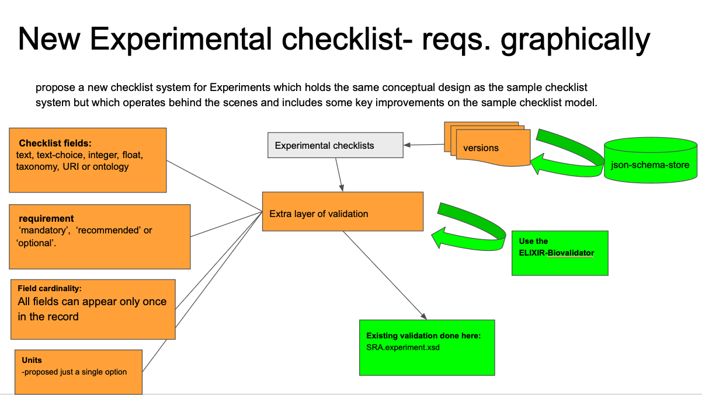

# This is the Experiment Checklist more Technically Focused Documentation


N.B. this will probably go to READTHEDOCS

## Introduction
The Experiment Checklists are an effort to create template to capture 
better metadata about experiments. The Sample Checklists have shown us how to usefully 
capture metadata, but also how to do this better.

[see README.md](../README.md) for more information about the purpose of this.

## Key Features
* a pair of JSON schema and JSON template per experiment type. The filled out template is validated against the schema. 
* details of what fields mandatory 
* conditional mandatory aspects allowed, e.g. if PCR then PCR values need to be provided.
* allowable controlled vocabulary 
* JSON schema rather than XML is the chosen technology as it has many advantages.




## Technology chosen was JSON schema
There are many advantages of JSON Schema over the older, but still venerable XML..
* JSON schema is more readily human-readable than XML. Both are machine-readable.
* Validation is very easy for things like controlled vocabularies.
* Dependency programming is relatively easy in JSON schema.

## Overview of How We Intend this to Work

* Programmatically manage the different Experiment Checklists
* Have each of the end product JSON checklists versioned.
* Have each of the end product JSON checklists validate. that can be immediately 
validated by user.

This generates JSON templates and JSON schemas for Experiment Checklists used for the ENA. There is a pair of JSON checklist template and JSON schema for each experiment type.
The aim is that we get higher quality metadata and due to the versioning we can just 
add improved JSON to future versions as needed, without worrying about backwards compatibility. 

## Valdation examples

### internal testing
For this is it is necessary to:
* have biovalidator installed and setup.
* d
current output of the validation (BTW: TEST_type is set-up to have most terms encountered across the all the experiments)
```
ic| testing_pairs: {'GENOMIC_schema.json': ['GENOMIC_works.json', 'GENOMIC_fails.json'],
                    'METABARCODING_schema.json': ['METABARCODING_works.json',
                                                  'METABARCODING_fails.json'],
                    'METATRANSCRIPTOMIC_schema.json': ['METATRANSCRIPTOMIC_works.json',
                                                       'METATRANSCRIPTOMIC_fails.json'],
                    'TEST_type_schema.json': ['TEST_type_works.json', 'TEST_type_fails.json'],
                    'TRANSCRIPTOMIC_schema.json': ['TRANSCRIPTOMIC_works.json',
                                                   'TRANSCRIPTOMIC_fails.json']}
ic| f"{schema_file} {test_file}": 'TEST_type_schema.json TEST_type_works.json'
ic| 'No validation errors reported'
ic| f"{schema_file} {test_file}": 'TEST_type_schema.json TEST_type_fails.json'
The validation process has found the following error(s): .pcr_primers should have required property \'pcr_primers\'  should match "then" schema 
/instrument_platform should be equal to one of the allowed values: ["BGISEQ","CAPILLARY","DNBSEQ","ILLUMINA","ION_TORRENT","LS454","OXFORD_NANOPORE","PACBIO_SMRT"] 
/sample_accession should match pattern "(^SAM(E|D|N)[A-Z]?[0-9]+)|(^(E|D|S)RS[0-9]{6,})" 
/study_id should match pattern "(^(E|D|S)RP[0-9]{6,})|(^PRJ(E|D|N)[A-Z][0-9]+)" '
ic| f"{schema_file} {test_file}": 'METABARCODING_schema.json METABARCODING_works.json'
ic| 'No validation errors reported'
ic| f"{schema_file} {test_file}": 'METABARCODING_schema.json METABARCODING_fails.json'
ic| 'No validation errors reported'
ic| f"{schema_file} {test_file}": 'METATRANSCRIPTOMIC_schema.json METATRANSCRIPTOMIC_works.json'
ic| 'No validation errors reported'
ic| f"{schema_file} {test_file}": 'METATRANSCRIPTOMIC_schema.json METATRANSCRIPTOMIC_fails.json'
ic| 'No validation errors reported'
ic| f"{schema_file} {test_file}": 'GENOMIC_schema.json GENOMIC_works.json'
ic| 'No validation errors reported'
```
### User Testing
* users will need to validate every <mark>experiment</mark> JSON file against the relevant schema
* We may need to get set up a web service to simplify this.

***
