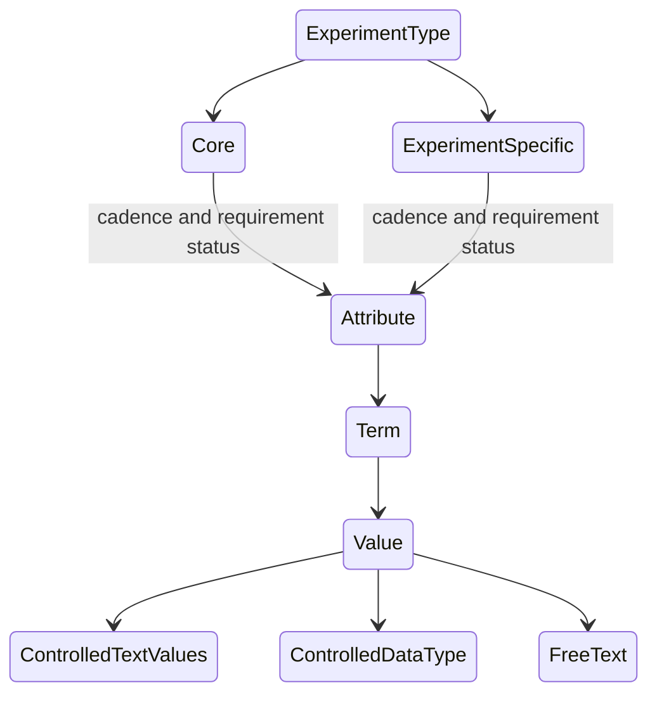

# Experiment Metadata Models
<!-- TOC -->
* [Experiment Metadata Models](#experiment-metadata-models)
  * [Context](#context)
  * [Experiment MetaModel](#experiment-metamodel)
  * [Experiment Metadata](#experiment-metadata)
<!-- TOC -->

## Context of the Models
The ENA metadata model: 

https://ena-docs.readthedocs.io/en/latest/submit/general-guide/metadata.html

## The Sequencing Experiment MetaModel

## The Sequencing Experiment Metadata