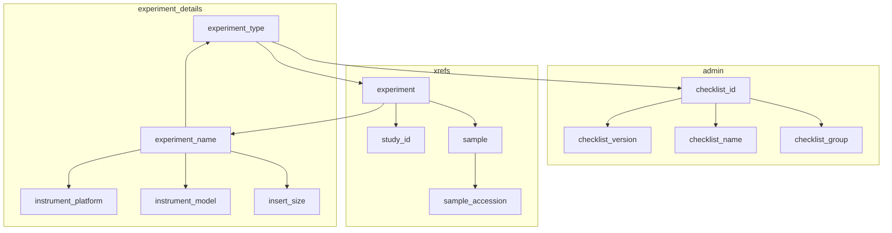
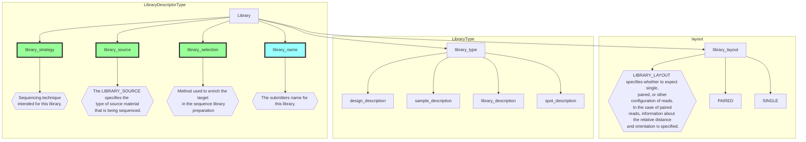
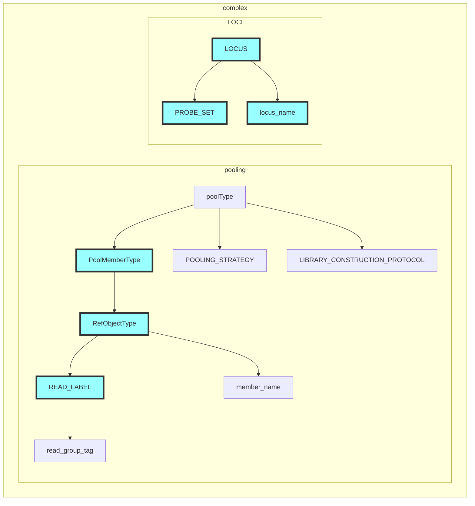

# Experimental Metadata

```mermaid
flowchart TD
    classDef mandatory fill:#99ff99,stroke:#333,stroke-width:4px;
    classDef optional fill:#99ffff,stroke:#333,stroke-width:4px;

    experiment_type --> checklist_id;
    experiment --> sample
    subgraph admin [admin]
        checklist_id --> checklist_group;
        checklist_id --> checklist_name;
        checklist_id --> checklist_version;
    end
    subgraph xrefs [xrefs]
        sample --> sample_accession;
        experiment --> study_id;
    end
    subgraph experiment_details [experiment_details]
        experiment_type --> experiment;
        experiment --> experiment_name;
        experiment_name --> experiment_type;
        experiment_name --> insert_size;
        experiment_name --> instrument_model;
        experiment_name --> instrument_platform;
    end
```
## Libraries

```mermaid
flowchart TD
    classDef mandatory fill:#99ff99,stroke:#333,stroke-width:4px;
    classDef optional fill:#99ffff,stroke:#333,stroke-width:4px;
    subgraph libraries [LibraryDescriptorType]
        Library --> library_strategy;
        Library --> library_source;
        Library --> library_selection;
        Library --> library_name;
        library_strategy -->  LStDes{{"Sequencing technique\n intended for this library."}};
        library_source -->  LSoDes{{"The LIBRARY_SOURCE specifies the \ntype of source material\n that is being sequenced."}};
        library_selection -->  LSeDes{{"Method used to enrich the target\n in the sequence library\n preparation"}};
        library_name -->  LNDes{{"The submitters name for this library."}};
        class library_strategy,library_source,library_selection mandatory;
        class library_name optional;
    end
    subgraph layout [layout]
        Library --> library_layout;
        library_layout -->  LLDes{{"LIBRARY_LAYOUT specifies whether to expect single,\n paired, or other configuration of reads.\n In the case of paired reads, information about the relative distance\n and orientation is specified."}}
        library_layout --> PAIRED;
        library_layout --> SINGLE;
    end
    subgraph LibraryType [LibraryType]
      Library --> library_type
      library_type --> design_description;
      library_type --> sample_description;
      library_type --> library_description;
      library_type --> spot_description 
    end
```
## complex

```mermaid
flowchart TD
    classDef mandatory fill:#99ff99,stroke:#333,stroke-width:4px;
    classDef optional fill:#99ffff,stroke:#333,stroke-width:4px;
    subgraph ComplexType [complex]
        poolType --> PoolMemberType
        subgraph pooling [pooling]
          PoolMemberType --> RefObjectType;
          RefObjectType --> READ_LABEL;
          READ_LABEL --> read_group_tag;
          RefObjectType --> member_name
          poolType --> POOLING_STRATEGY
          poolType --> LIBRARY_CONSTRUCTION_PROTOCOL
        end
        subgraph LOCI [LOCI]
          LOCUS --> PROBE_SET;
          LOCUS --> locus_name;
        end
        class TARGETED_LOCI,LOCUS,PROBE_SET,locus_name optional;
        class RefObjectType mandatory;
        class PoolMemberType,RefObjectType,READ_LABEL,RefObjectType optional;
    end

    

```