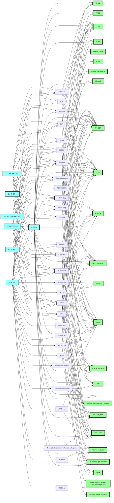

# Library Metadata

```mermaid
flowchart LR
classDef library_selection fill:#99ff99,stroke:#333,stroke-width:4px;
classDef library_source fill:#99ffff,stroke:#333,stroke-width:4px;
AMPLICON --> Hybrid_Selection
AMPLICON --> PCR
AMPLICON --> RACE
AMPLICON --> RANDOM
AMPLICON --> RANDOM_PCR
AMPLICON --> RT-PCR
AMPLICON --> Restriction_Digest
AMPLICON --> cDNA
AMPLICON --> other
AMPLICON --> size_fractionation
AMPLICON --> unspecified
ATAC-seq --> other
ATAC-seq --> unspecified
Bisulfite-Seq --> Hybrid_Selection
Bisulfite-Seq --> PCR
Bisulfite-Seq --> RANDOM
Bisulfite-Seq --> Reduced_Representation
Bisulfite-Seq --> other
Bisulfite-Seq --> padlock_probes_capture_method
Bisulfite-Seq --> size_fractionation
Bisulfite-Seq --> unspecified
CLONE --> PCR
CLONE --> RANDOM
CLONE --> cDNA
CLONE --> other
CLONEEND --> CAGE
CLONEEND --> PCR
CLONEEND --> RANDOM
CLONEEND --> cDNA
CTS --> PCR
CTS --> cDNA
ChIP-Seq --> ChIP
ChIP-Seq --> MNase
ChIP-Seq --> PCR
ChIP-Seq --> RANDOM
ChIP-Seq --> other
ChIP-Seq --> size_fractionation
ChIP-Seq --> unspecified
DNase-Hypersensitivity --> DNase
EST --> CAGE
EST --> Hybrid_Selection
EST --> PCR
EST --> RANDOM
EST --> cDNA
FAIRE-seq --> other
FL-cDNA --> RANDOM
FL-cDNA --> RANDOM_PCR
FL-cDNA --> cDNA
FL-cDNA --> other
GENOMIC --> AMPLICON
GENOMIC --> ATAC-seq
GENOMIC --> Bisulfite-Seq
GENOMIC --> CLONE
GENOMIC --> CLONEEND
GENOMIC --> CTS
GENOMIC --> ChIP-Seq
GENOMIC --> DNase-Hypersensitivity
GENOMIC --> EST
GENOMIC --> FAIRE-seq
GENOMIC --> MBD-Seq
GENOMIC --> MNase-Seq
GENOMIC --> MeDIP-Seq
GENOMIC --> OTHER
GENOMIC --> POOLCLONE
GENOMIC --> RAD-Seq
GENOMIC --> RNA-Seq
GENOMIC --> SELEX
GENOMIC --> Synthetic-Long-Read
GENOMIC --> Targeted-Capture
GENOMIC --> Tethered_Chromatin_Conformation_Capture
GENOMIC --> Tn-Seq
GENOMIC --> WCS
GENOMIC --> WGA
GENOMIC --> WGS
GENOMIC --> WXS
GENOMIC --> miRNA-Seq
MBD-Seq --> MBD2_protein_methyl-CpG_binding_domain
METAGENOMIC --> AMPLICON
METAGENOMIC --> CLONE
METAGENOMIC --> CLONEEND
METAGENOMIC --> ChIP-Seq
METAGENOMIC --> OTHER
METAGENOMIC --> RNA-Seq
METAGENOMIC --> Targeted-Capture
METAGENOMIC --> WGA
METAGENOMIC --> WGS
METATRANSCRIPTOMIC --> AMPLICON
METATRANSCRIPTOMIC --> EST
METATRANSCRIPTOMIC --> OTHER
METATRANSCRIPTOMIC --> RNA-Seq
METATRANSCRIPTOMIC --> WGS
METATRANSCRIPTOMIC --> miRNA-Seq
MNase-Seq --> MNase
MeDIP-Seq --> 5-methylcytidine_antibody
MeDIP-Seq --> ChIP
MeDIP-Seq --> MBD2_protein_methyl-CpG_binding_domain
MeDIP-Seq --> other
OTHER --> AMPLICON
OTHER --> Bisulfite-Seq
OTHER --> CAGE
OTHER --> ChIP
OTHER --> ChIP-Seq
OTHER --> DNase
OTHER --> EST
OTHER --> Hybrid_Selection
OTHER --> OTHER
OTHER --> Oligo-dT
OTHER --> PCR
OTHER --> RACE
OTHER --> RANDOM
OTHER --> RANDOM_PCR
OTHER --> RIP-Seq
OTHER --> RNA-Seq
OTHER --> RT-PCR
OTHER --> Reduced_Representation
OTHER --> Restriction_Digest
OTHER --> Tn-Seq
OTHER --> WGS
OTHER --> cDNA
OTHER --> miRNA-Seq
OTHER --> ncRNA-Seq
OTHER --> other
OTHER --> size_fractionation
OTHER --> unspecified
POOLCLONE --> PCR
POOLCLONE --> RANDOM
POOLCLONE --> other
RAD-Seq --> Reduced_Representation
RAD-Seq --> Restriction_Digest
RIP-Seq --> ChIP
RIP-Seq --> RANDOM
RIP-Seq --> cDNA
RIP-Seq --> other
RNA-Seq --> CAGE
RNA-Seq --> DNase
RNA-Seq --> Hybrid_Selection
RNA-Seq --> Inverse_rRNA
RNA-Seq --> Oligo-dT
RNA-Seq --> PCR
RNA-Seq --> PolyA
RNA-Seq --> RACE
RNA-Seq --> RANDOM
RNA-Seq --> RANDOM_PCR
RNA-Seq --> RT-PCR
RNA-Seq --> cDNA
RNA-Seq --> other
RNA-Seq --> repeat_fractionation
RNA-Seq --> size_fractionation
RNA-Seq --> unspecified
SELEX --> PCR
SELEX --> other
SYNTHETIC --> AMPLICON
SYNTHETIC --> CLONE
SYNTHETIC --> OTHER
SYNTHETIC --> RNA-Seq
Synthetic-Long-Read --> Hybrid_Selection
TRANSCRIPTOMIC --> AMPLICON
TRANSCRIPTOMIC --> CLONE
TRANSCRIPTOMIC --> CLONEEND
TRANSCRIPTOMIC --> CTS
TRANSCRIPTOMIC --> ChIP-Seq
TRANSCRIPTOMIC --> EST
TRANSCRIPTOMIC --> FL-cDNA
TRANSCRIPTOMIC --> OTHER
TRANSCRIPTOMIC --> RIP-Seq
TRANSCRIPTOMIC --> RNA-Seq
TRANSCRIPTOMIC --> SELEX
TRANSCRIPTOMIC --> Targeted-Capture
TRANSCRIPTOMIC --> WGS
TRANSCRIPTOMIC --> miRNA-Seq
TRANSCRIPTOMIC --> ncRNA-Seq
Targeted-Capture --> Hybrid_Selection
Targeted-Capture --> Oligo-dT
Targeted-Capture --> PCR
Targeted-Capture --> RANDOM
Targeted-Capture --> other
Tethered_Chromatin_Conformation_Capture --> Restriction_Digest
Tethered_Chromatin_Conformation_Capture --> unspecified
Tn-Seq --> PCR
VIRAL_RNA --> AMPLICON
VIRAL_RNA --> FL-cDNA
VIRAL_RNA --> OTHER
VIRAL_RNA --> RNA-Seq
VIRAL_RNA --> WGS
WCS --> MDA
WCS --> RANDOM
WCS --> unspecified
WGA --> MDA
WGA --> PCR
WGA --> RANDOM
WGA --> RANDOM_PCR
WGA --> RT-PCR
WGA --> size_fractionation
WGA --> unspecified
WGS --> ChIP
WGS --> DNase
WGS --> Hybrid_Selection
WGS --> MDA
WGS --> PCR
WGS --> RANDOM
WGS --> RANDOM_PCR
WGS --> RT-PCR
WGS --> Reduced_Representation
WGS --> Restriction_Digest
WGS --> cDNA
WGS --> other
WGS --> size_fractionation
WGS --> unspecified
WXS --> Hybrid_Selection
WXS --> PCR
WXS --> RANDOM
WXS --> RANDOM_PCR
WXS --> unspecified
miRNA-Seq --> PCR
miRNA-Seq --> RANDOM
miRNA-Seq --> RT-PCR
miRNA-Seq --> cDNA
miRNA-Seq --> other
miRNA-Seq --> size_fractionation
miRNA-Seq --> unspecified
ncRNA-Seq --> RANDOM
ncRNA-Seq --> RT-PCR
ncRNA-Seq --> other
ncRNA-Seq --> size_fractionation
class 5-methylcytidine_antibody,CAGE,ChIP,DNase,Hybrid_Selection,Inverse_rRNA,MBD2_protein_methyl-CpG_binding_domain,MDA,MNase,Oligo-dT,PCR,PolyA,RACE,RANDOM,RANDOM_PCR,RT-PCR,Reduced_Representation,Restriction_Digest,cDNA,library_selection,other,padlock_probes_capture_method,repeat_fractionation,size_fractionation,unspecified library_selection;
class GENOMIC,METAGENOMIC,METATRANSCRIPTOMIC,OTHER,SYNTHETIC,TRANSCRIPTOMIC,VIRAL_RNA library_source
```
